<div align="center">

# 👨‍💻 Marcos Alvarez

### Full Stack Developer | AI-Powered Development Enthusiast | Tech Problem Solver

[](https://marcosalvarez-dev.netlify.app/)
[](https://www.linkedin.com/in/marcos-alvarez-calabria)
[](mailto:calalva82@gmail.com)


</div>

---

## 🎯 Current Mission

<table>
<tr>
<td width="50%">

### 🎓 Studying
**Master's in Software Development with AI**  
*BIG school*

- 🤖 AI-Powered Development Workflows
- 🏗️ Software Architecture & Design Patterns
- ☁️ Cloud Computing & DevOps
- 🔒 Security & Best Practices
- 🧪 Testing & Clean Code

</td>
<td width="50%">

### 💼 Working
**Electronics Technician @ Fonez**  
*Galway, Ireland*

- 🔧 Device Repair & Diagnostics
- 🔬 Motherboard-Level Troubleshooting
- 📱 iPhone & Samsung Specialized
- 💡 Technical Problem-Solving

</td>
</tr>
</table>

---

## 🚀 My Journey

```mermaid
graph LR
    A[🔧 Tech Repair] --> B[💻 Web Development]
    B --> C[🎓 IronHack Bootcamp]
    C --> D[👨‍💻 Full Stack Developer]
    D --> E[🤖 AI Development Master]
    E --> F[🌟 Future Tech Leader]
```


> **From fixing circuits to writing code** - My passion for understanding how things work has evolved from repairing hardware to creating innovative software solutions. Every challenge is an opportunity to learn and grow.

---

## 💻 Tech Stack

<div align="center">

### Languages & Frameworks


### Databases & Tools


### AI & Modern Development


</div>

---

## 🎨 Featured Projects

<div align="center">

<table>
<tr>
<td width="50%">

### 🎬 [cineHub](https://cine-hub.fly.dev)
Full-stack movie application with modern UI

**Stack:** React · Bootstrap · MongoDB · Express

🔹 User authentication  
🔹 Movie database integration  
🔹 Responsive design  

</td>
<td width="50%">

### 🔄 [conXchange](https://conoxchange.fly.dev/)
Community exchange platform

**Stack:** Handlebars · MongoDB · Express

🔹 Real-time interactions  
🔹 User profiles  
🔹 Item exchange system  

</td>
</tr>

<tr>
<td width="50%">

### 🐉 [Dragon Ball Game](https://fascinating-stardust-46fddd.netlify.app)
Interactive browser-based game

**Stack:** HTML5 · CSS3 · JavaScript

🔹 Canvas animations  
🔹 Game mechanics  
🔹 Score tracking  

</td>
<td width="50%">

### 🌍 [Agencia Cusco](https://marcosalvarez-dev.netlify.app/)
Tourism website with modern UX

**Stack:** React · Astro · Modern CSS

🔹 Skeleton loading  
🔹 Optimized performance  
🔹 Mobile-first design  

</td>
</tr>
</table>

**[📂 View All Projects →](https://github.com/marcosAlvarezCalabria?tab=repositories)**

</div>

---

## 📚 Currently Learning

<div align="center">
```typescript
const currentFocus = {
  master: "Software Development with AI @ BIG school",
  topics: [
    "🤖 AI Integration in Development Workflows",
    "🏗️ Clean Architecture & Design Patterns",
    "☁️ Cloud Computing & Infrastructure",
    "🔐 DevSecOps & Security Best Practices",
    "🧪 Testing & Quality Assurance",
    "📦 Docker & CI/CD Pipelines"
  ],
  tools: [
    "VS Code + GitHub Copilot",
    "Cursor IDE",
    "Claude Code",
    "LangChain",
    "n8n Automation"
  ],
  goal: "Become an AI-augmented developer 🚀"
};
```

</div>

---

## 💡 Development Philosophy

<div align="center">

> ### *"Every error is an opportunity for learning, every success is a step towards excellence"*

<table>
<tr>
<td align="center" width="33%">

### 🎯 Focus
**Quality over quantity**  
Every line of code matters

</td>
<td align="center" width="33%">

### 🚀 Innovation
**Embrace new technologies**  
AI-powered development

</td>
<td align="center" width="33%">

### 📈 Growth
**Never stop learning**  
Continuous improvement

</td>
</tr>
</table>

</div>

---

## 📊 GitHub Stats

<div align="center">


</div>

---

## 🤝 Let's Connect!

<div align="center">

### I'm always open to collaborations, feedback, and new opportunities!

<table>
<tr>
<td align="center">
<a href="https://marcosalvarez-dev.netlify.app/">

<br>
<b>Portfolio</b>
</a>
</td>
<td align="center">
<a href="https://www.linkedin.com/in/marcos-alvarez-calabria">

<br>
<b>LinkedIn</b>
</a>
</td>
<td align="center">
<a href="mailto:calalva82@gmail.com">

<br>
<b>Email</b>
</a>
</td>
<td align="center">
<a href="https://github.com/marcosAlvarezCalabria">

<br>
<b>GitHub</b>
</a>
</td>
</tr>
</table>

---

### 💬 *"Thank you for visiting my GitHub! Let's build something amazing together!"* 🚀


</div>
